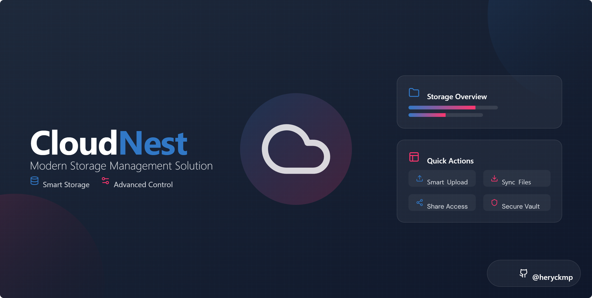

# CloudNest - Modern Storage Management Solution

<div align="center">
  <br />
    
  <br />

  <div>
     
    
    
    
  </div>
<h3 align="center">Plataforma de Próxima Geração para Compartilhamento de Arquivos</h3>

   <div align="center">
     Desenvolvido por <a href="https://github.com/heryckmp" target="_blank"><b>Erick Moreira</b></a>
    </div>
</div>

## 📋 Índice

1. 🚀 [Introdução](#introdução)
2. ⚙️ [Tecnologias](#tecnologias)
3. 🔋 [Funcionalidades](#funcionalidades)
4. 🌟 [Inovações](#inovações)
5. 🤸 [Início Rápido](#início-rápido)
6. 🎨 [Sistema de Design](#sistema-de-design)
7. 🔒 [Segurança](#segurança)

## 🚀 Introdução

CloudNest é uma plataforma de gerenciamento de armazenamento e compartilhamento de arquivos de última geração que revoluciona a forma como os usuários interagem com seu conteúdo digital. Construída com as mais recentes tecnologias web, oferece uma experiência segura, intuitiva e sem complicações para gerenciar e compartilhar arquivos na nuvem.

## ⚙️ Tecnologias

- **Frontend**: React 19 com Next.js 15
- **Backend**: Appwrite Cloud
- **Estilização**: TailwindCSS com ShadCN
- **Linguagem**: TypeScript
- **Gerenciamento de Estado**: React Context API
- **Autenticação**: Appwrite Auth

## 🔋 Funcionalidades

- **Gerenciamento Inteligente de Arquivos**
  - Organização avançada com categorização inteligente
  - Suporte a operações em lote
  - Histórico de versões

- **Segurança Aprimorada**
  - Criptografia ponta a ponta para arquivos sensíveis
  - Autenticação de dois fatores
  - Controles granulares de permissão

- **Interface Moderna**
  - Suporte a tema claro/escuro
  - Design responsivo para todos os dispositivos
  - Interface intuitiva com arrastar e soltar

- **Busca Inteligente**
  - Capacidade de busca em texto completo
  - Indexação de conteúdo de arquivos
  - Opções avançadas de filtro

- **Colaboração em Tempo Real**
  - Compartilhamento de arquivos com permissões personalizáveis
  - Suporte a espaço de trabalho em equipe
  - Rastreamento de atividades e notificações

## 🌟 Inovações

CloudNest introduz várias características inovadoras que o destacam:

1. **Otimização Inteligente de Armazenamento**
   - Detecção automática de duplicatas
   - Algoritmos inteligentes de compressão
   - Cache preditivo

2. **Organização Baseada em IA**
   - Categorização automática de arquivos
   - Sugestões baseadas em conteúdo
   - Sistema inteligente de tags

3. **Medidas Avançadas de Segurança**
   - Criptografia de conhecimento zero
   - Integridade de arquivos verificada por blockchain
   - Detecção avançada de ameaças

## 🤸 Início Rápido

1. **Clone o repositório**
```bash
git clone https://github.com/heryckmp/cloudnest.git
cd cloudnest
```

2. **Instale as dependências**
```bash
npm install
```

3. **Configure as variáveis de ambiente**
Crie um arquivo `.env.local`:
```env
NEXT_PUBLIC_APPWRITE_ENDPOINT="https://cloud.appwrite.io/v1"
NEXT_PUBLIC_APPWRITE_PROJECT=""
NEXT_PUBLIC_APPWRITE_DATABASE=""
NEXT_PUBLIC_APPWRITE_USERS_COLLECTION=""
NEXT_PUBLIC_APPWRITE_FILES_COLLECTION=""
NEXT_PUBLIC_APPWRITE_BUCKET=""
NEXT_APPWRITE_KEY=""
```

4. **Inicie o servidor de desenvolvimento**
```bash
npm run dev
```

## 🎨 Sistema de Design

CloudNest possui um sistema de design abrangente que garante consistência e acessibilidade:

- **Paleta de Cores**: Cores cuidadosamente selecionadas para temas claro e escuro
- **Tipografia**: Hierarquia de fontes moderna e legível
- **Componentes**: Componentes de UI reutilizáveis e acessíveis
- **Animações**: Design de movimento suave e proposital

## 🔒 Segurança

A segurança está no núcleo da arquitetura do CloudNest:

- Criptografia ponta a ponta
- Auditorias regulares de segurança
- Conformidade com LGPD
- Protocolos seguros de compartilhamento de arquivos
- Controle avançado de acesso

---

<div align="center">
  <h3>Desenvolvedor</h3>
  <a href="https://github.com/heryckmp">GitHub</a>
</div>